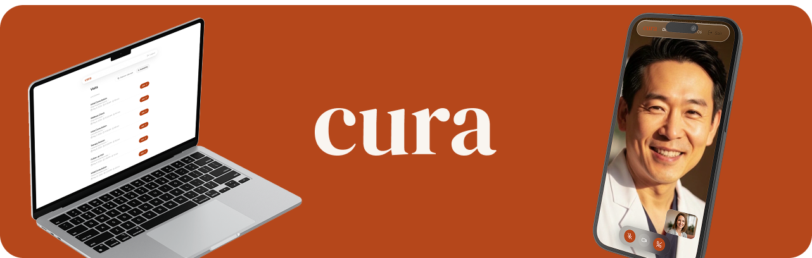

# cura

**cura** is a real-time AI co-pilot that turns medical appointments into structured medical intelligence, without breaking the human interaction. 💊

## Team 💪

Built with passion at Shift APPens by a team of four dedicated shifters:

- [Guilherme Ferreira](https://github.com/guilhermepsf)
- [João Lobo](https://github.com/joaodiaslobo)
- [Júlio Pinto](https://github.com/juliojpinto)
- [Mário Rodrigues](https://github.com/mariorodrigues10)